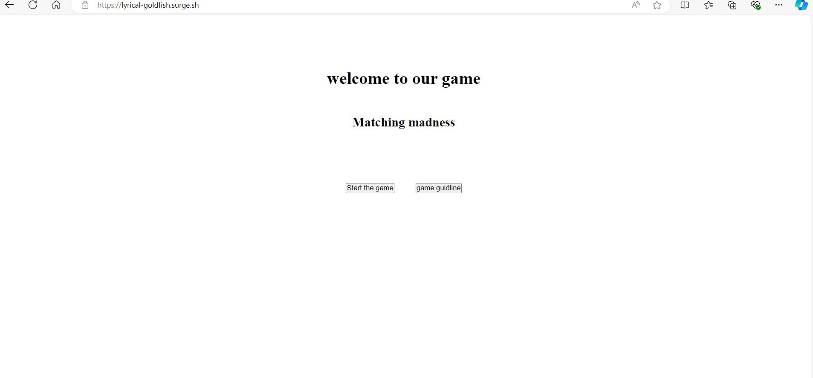
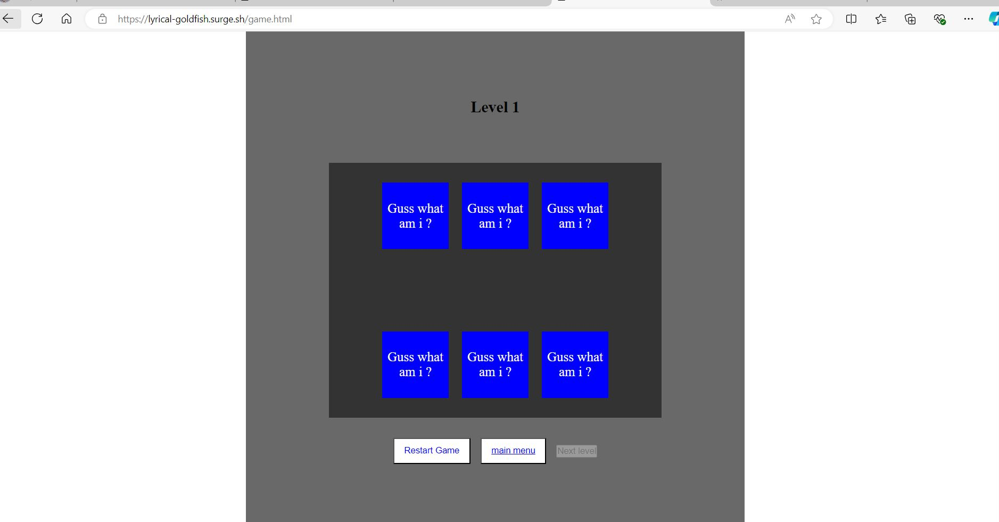
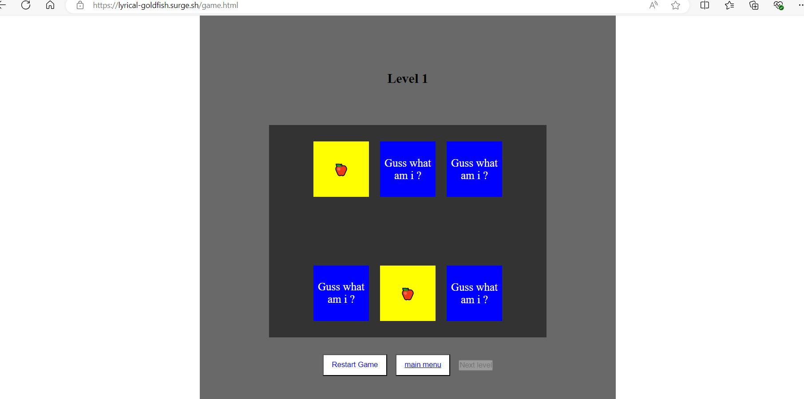
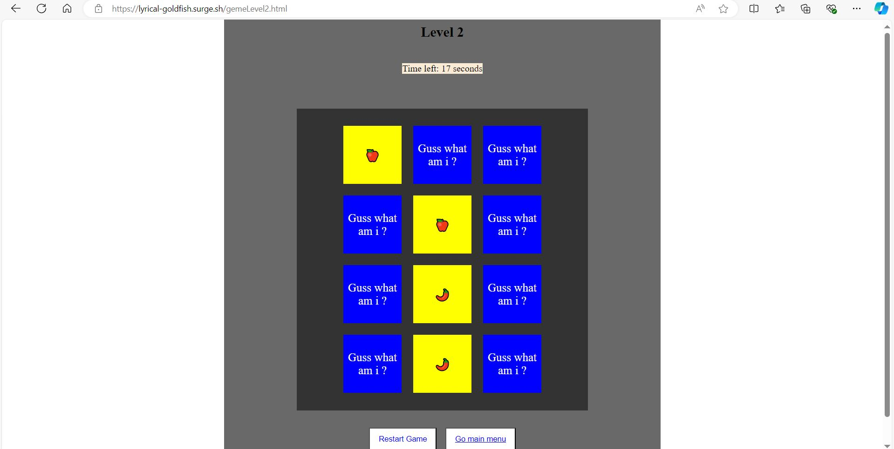
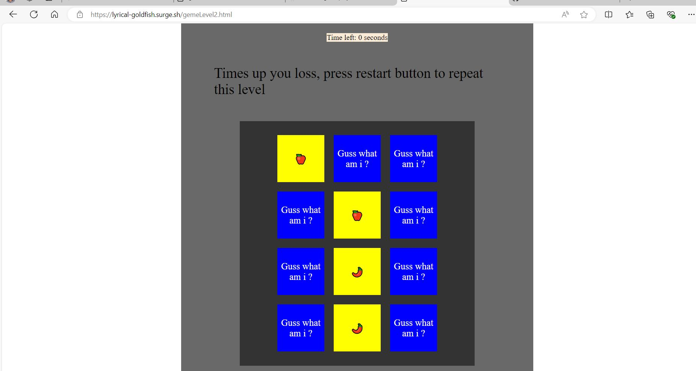
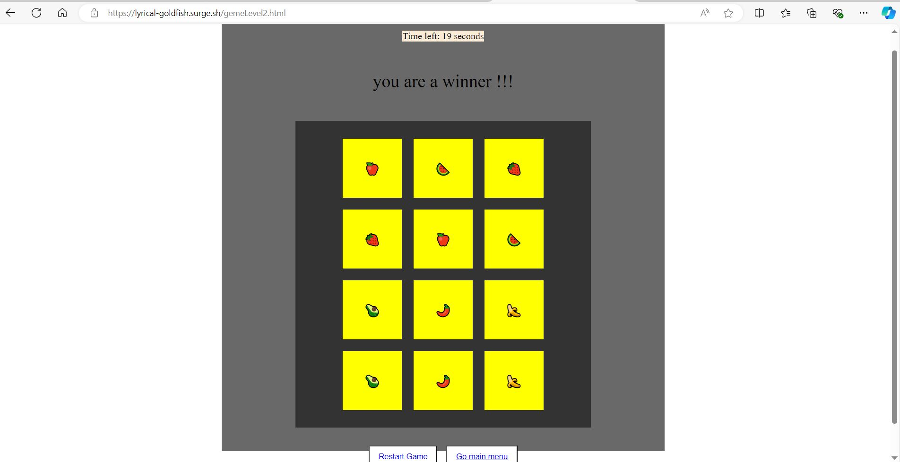

# my game name is maching madness

- mainly our game is depending on if you guess the place of the cards right, if you guess it right the cards that you choose it will match and show that both front face is same , and if you choose the second card and it was wrong both cards will flip back again on their faces.

# screenshots

## My home page

## level1

## level 1 matching

## level 2

## time up

## winng

# Game link

**https://lyrical-goldfish.surge.sh/**

## Attributions used

**i have used the w3school to help me in understand how to use some new methods that i learnd.**

## Technologies used:

_javaScript_

_css_

_html_

## Next steps:

**i will add new levels and it will be more harder and also will change the fonts and colors to make it more likley to the users.**

## My user stories:

for creating a flip cards game that if you match two of the cards you will win but if you only guess and the
another card was wrong it will be flipped agin.

**1-as a user, first page i want to show above the name of the game and a guidline button that will show for me
how to play the game and what are the rules.**

**2-as a user, i want it to show for me a start game button.**

**3-as a user , first i want the card to be flipped then it will be flipped again on their faces so i can guess
whare the two cards places will be.**

**4-as a user, when i flip a card i want it to still be flipped tell i flip the second card that it may match
or not match the flipped card.**

**5-as a user, i want to have a multiple try to guess where each card is.**

**6-as a user, i will win when i guess all the cards right.**

**7-as a user,while i'm playing show for me a sucsess message if i guess all the cards that they was in level1 or level 2.**
